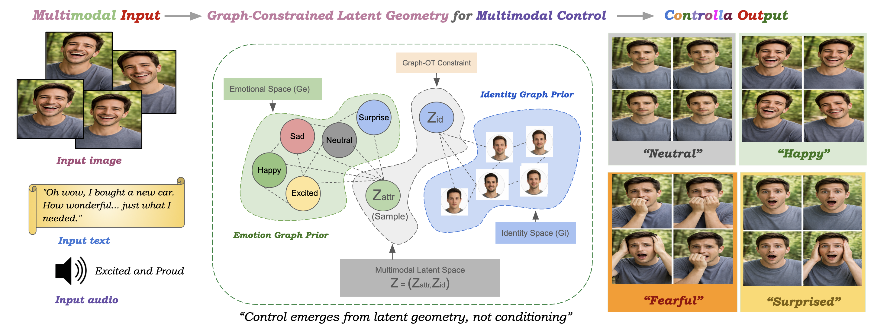
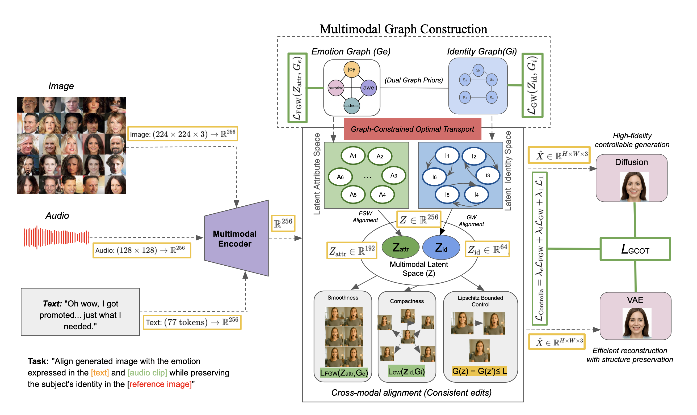
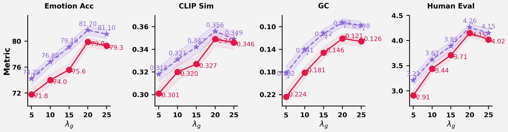
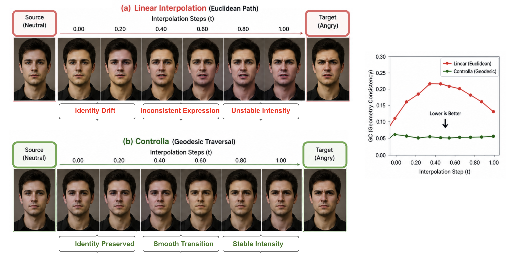
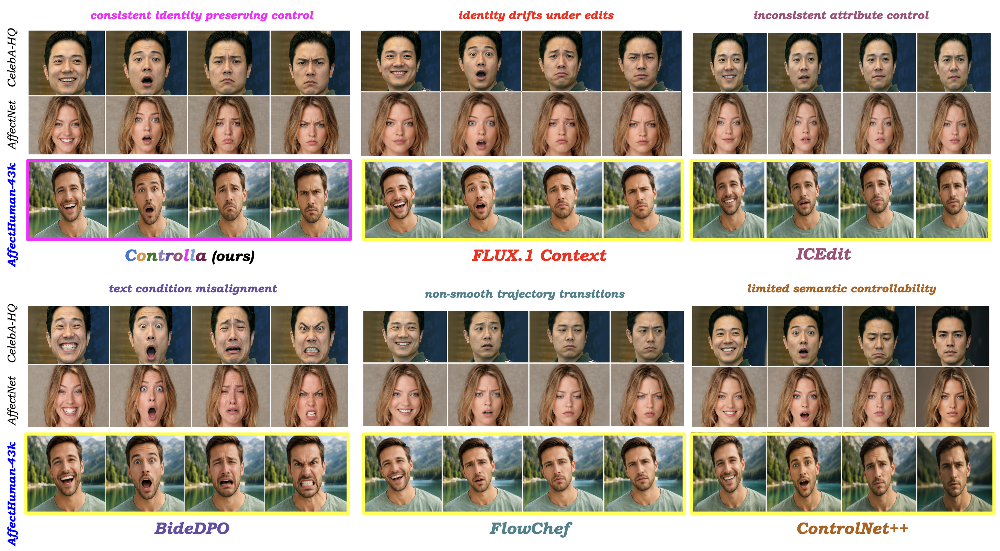
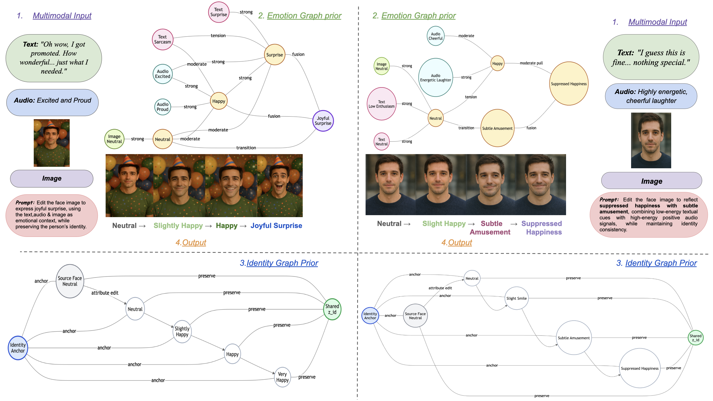

# 🎨 Controlla

**Multimodal affect-guided human generation with identity preservation**

[](https://huggingface.co/datasets/iamjamuna/AffectHuman-43K)
[](https://arxiv.org/abs/XXXX.XXXXX)
[](https://www.python.org/)
[](https://pytorch.org/)

---

## ✨ Overview

**Controlla** is a research codebase for controllable human image generation and editing under multimodal affective conditioning. The system combines a diffusion backbone with identity, emotion, audio, text, and graph-fusion modules so a model can preserve a reference identity while following affective control signals.

The companion dataset is **AffectHuman-43K**, available here:

🔗 **Dataset:** [https://huggingface.co/datasets/iamjamuna/AffectHuman-43K](https://huggingface.co/datasets/iamjamuna/AffectHuman-43K)

---

## 🌈 What Controlla Supports

- **Identity preservation** through reference-image conditioning
- **Affective control** from emotion labels, text prompts, and speech/audio features
- **Graph-based multimodal fusion** across identity, image, text, audio, and emotion branches
- **Optimal-transport-style alignment hooks** for structured cross-modal matching
- **Ablation-ready configs** for identity, graph, and alignment studies
- **Lightweight smoke tests** using a mock diffusion backbone
- **Stable Diffusion integration path** for full research runs when weights are available locally

---

## 📦 Dataset: AffectHuman-43K

**AffectHuman-43K** is an emotion-aligned multimodal benchmark for controlled human affect generation and evaluation.

| Item | Value |
|---|---:|
| Usable samples | **42,469** |
| Modalities | Image, reference image, audio, text |
| Emotion classes | 8 |
| Train / validation / test | 29,728 / 6,371 / 6,370 |
| Cross-split reference-identity leakage | 0 |
| Dataset hub | [AffectHuman-43K](https://huggingface.co/datasets/iamjamuna/AffectHuman-43K) |

The intended sample interpretation is:

```text
reference image -> identity condition
text/audio/emotion label -> affective control condition
target image -> supervision or evaluation target
```

---

## 🧠 Architecture

Controlla is organized as composable modules:

```text
reference image ──► identity encoder ┐
target image ─────► image encoder    │
text prompt ──────► text encoder     ├──► graph fusion ──► diffusion adapter ──► generated image
audio features ───► audio encoder    │
emotion label ────► emotion encoder  │
                                  OT/alignment hooks
```

---

## 🖼️ Figure Guide

All visual assets live in [`controlla/images`](controlla/images). Click any figure to open the full-resolution image.

### Figure 1 — Structured Latent Geometry

[](controlla/images/Figure1.png)

[`Figure1.png`](controlla/images/Figure1.png) shows Controlla's main control idea: image, reference image, text, and audio are mapped into factorized identity and attribute spaces. The attribute factor follows graph-consistent semantic movement, while the reference-grounded identity factor is kept stable.

### Figure 2 — Controlla Framework

[](controlla/images/Figure2.png)

[`Figure2.png`](controlla/images/Figure2.png) explains the full framework. Multimodal inputs are encoded into a shared representation, split into attribute and identity components, and aligned with emotion and identity graph priors through graph-constrained optimal transport. This is the core path that supports affective edits without losing the reference identity.

### Figure 3 — Graph Strength Ablation

[](controlla/images/Figure3.png)

[`Figure3.png`](controlla/images/Figure3.png) summarizes how the graph-strength weight changes behavior. Stronger graph regularization improves controllability and human preference while lowering geodesic inconsistency; CLIP-style alignment is treated as an auxiliary diagnostic rather than the main success signal.

### Figure 4 — Graph-Consistent vs. Linear Traversal

[](controlla/images/Figure4.png)

[`Figure4.png`](controlla/images/Figure4.png) compares graph-guided semantic traversal with ordinary linear interpolation. The graph-consistent path gives smoother affective transitions and better identity stability because movement follows the learned emotion geometry instead of cutting directly through latent space.

### Figure 5 — Cross-Dataset Qualitative Comparison

[](controlla/images/Figure5.png)

[`Figure5.png`](controlla/images/Figure5.png) compares generated examples across datasets and methods under matched inputs. It highlights whether each method preserves identity, follows the requested expression, and stays semantically aligned across different source distributions.

### Figure 6 — Graph-Guided Latent Control

[](controlla/images/Figure6.png)

[`Figure6.png`](controlla/images/Figure6.png) visualizes graph-guided latent control over emotion transitions. The structured path produces smoother, more interpretable changes while maintaining identity more consistently than linear interpolation.

---

## 🚀 Quick Start

```bash
cd controlla
python -m venv .venv
source .venv/bin/activate
pip install -e .
python -m pytest tests -q
```

Run a tiny training smoke test:

```bash
python -m pipelines.train_controlla \
  --config configs/train.yaml \
  --dummy-data
```

Run dummy inference:

```bash
python -m pipelines.infer_controlla \
  --config configs/infer.yaml \
  --prompt "calm portrait"
```

---

## 🗂️ Project Layout

```text
controlla/
├── configs/              # Training, inference, and ablation presets
├── data/                 # Dataset classes and transforms
├── models/               # Encoders, graph fusion, adapters, diffusion backbone
├── losses/               # Identity, emotion, graph, contrastive, and aggregate losses
├── trainers/             # Train/eval loops
├── pipelines/            # CLI entrypoints
├── experiments/          # Evaluation runners, metrics, reports, and baselines
├── evaluation/           # Evaluation helpers and caching
├── utils/                # Config, manifests, logging, seed, checkpoints
├── tests/                # Smoke and regression tests
└── images/               # Architecture and result figures
```

---

## 📊 Evaluation Areas

Controlla includes reusable components for evaluating:

- **Affective controllability**
- **Identity preservation**
- **Cross-modal consistency**
- **Disentanglement**
- **Retrieval alignment**
- **Latency and overhead**
- **Ablations across modules and modalities**

---

## 👥 Authors

| Author | Affiliation |
|---|---|
| **Jamuna S. Murthy** | Ramaiah Institute of Technology |
| **Amin Karimi Monsefi** | The Ohio State University |
| **Rajiv Ramnath** | The Ohio State University |

---

## 📄 Paper

An arXiv link will be added here when available:

🔗 **Paper:** [Controlla: Learning Controllability via Graph-Constrained Latent Geometry](https://arxiv.org/pdf/2605.16603)

---

## 📚 Citation

```bibtex
@misc{controlla2026,
  title        = {Controlla: Multimodal Affect-Guided Human Generation with Identity Preservation},
  author       = {Murthy, Jamuna S. and Monsefi, Amin Karimi and Ramnath, Rajiv},
  year         = {2026},
  note         = {arXiv link to be added}
}
```

---

## ⚖️ License And Responsible Use

The AffectHuman-43K dataset and dataset-builder release are governed by the repository [`LICENSE`](LICENSE): **research-only, non-commercial academic use, benchmarking, and evaluation**. Redistribution of raw dataset files is not permitted. Users must also comply with the licenses and terms of all upstream datasets and models used with AffectHuman-43K.

This project is intended for research on affective controllable generation. Do not use it for impersonation, identity targeting, surveillance, harassment, or non-consensual synthetic media generation.

---

<div align="center">

**⭐ Star the repository if Controlla helps your research.**

Built for careful, reproducible multimodal generation research.

</div>
